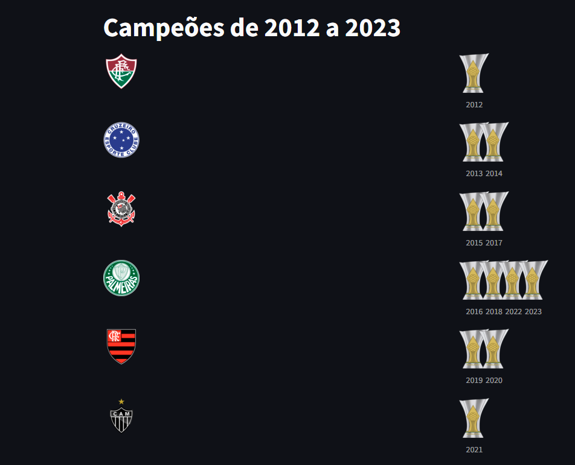
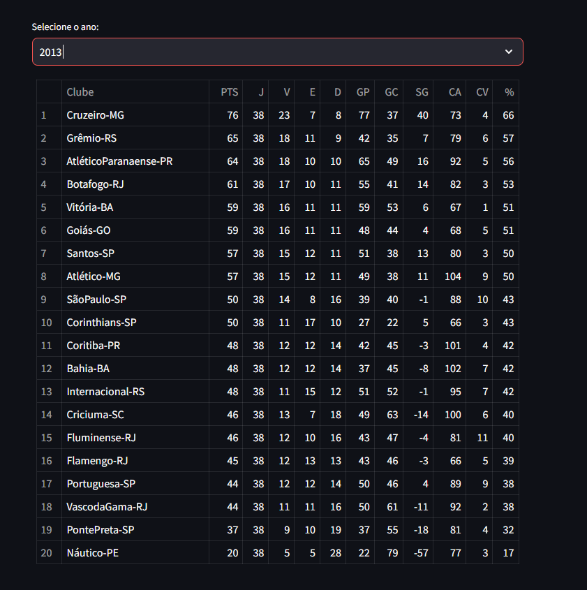
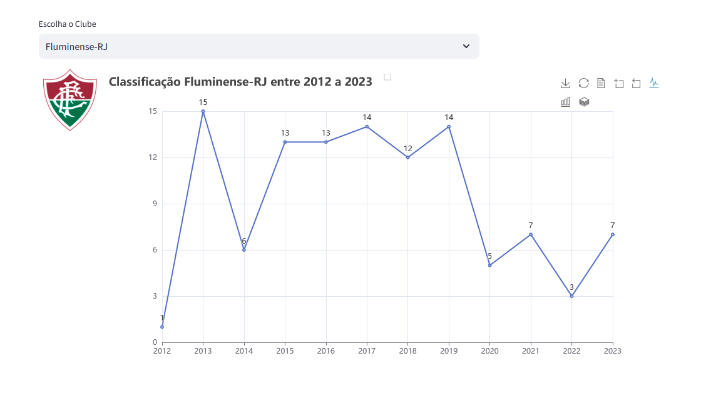
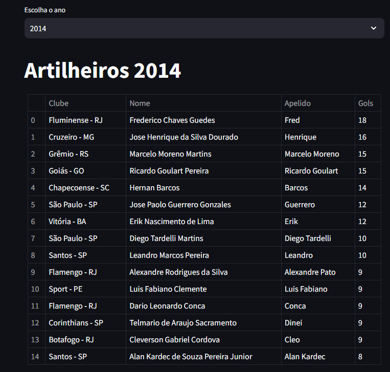

<H1>Data Brasileirão</H1>

Projeto exibe dados de raspagem obtidos no site da Confederação Brasileira de Futebol (CBF)
referente aos campeonatos brasileiros enntre 2012 a 2023.

📋 Pré-requisitos

- Instalação Python
- Instalar arquivo requirements.txt

Informações Obtidas

  <h4>Lista de times campeões e respectivos anos do título</h4>
  

  <h4>Tabelas com todos os dados segmentado pelo ano</h4>
  

  <h4>Desempenho dos clubes entre os anos de 2012 a 2023</h4>
  

  <h4>Artilharia entre os anos de 2012 a 2023</h4>
  

  
